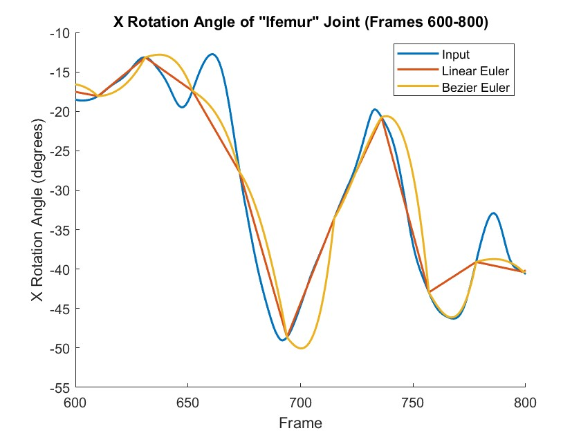
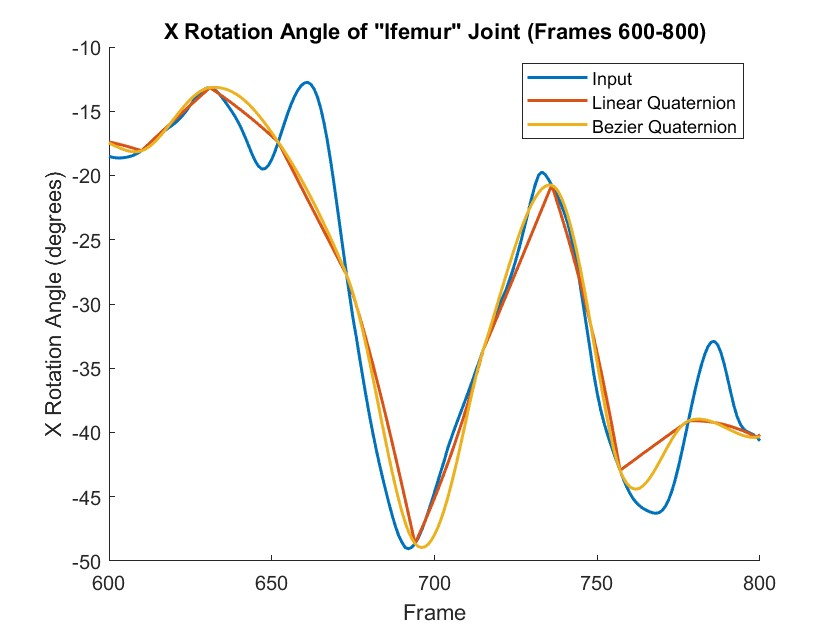
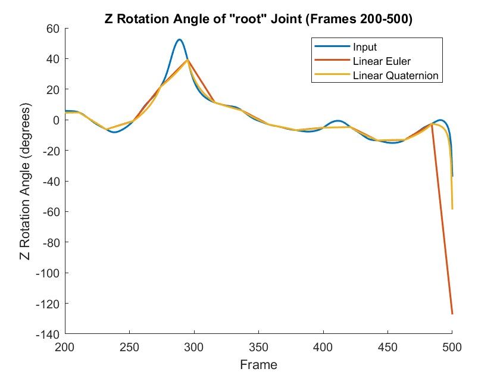
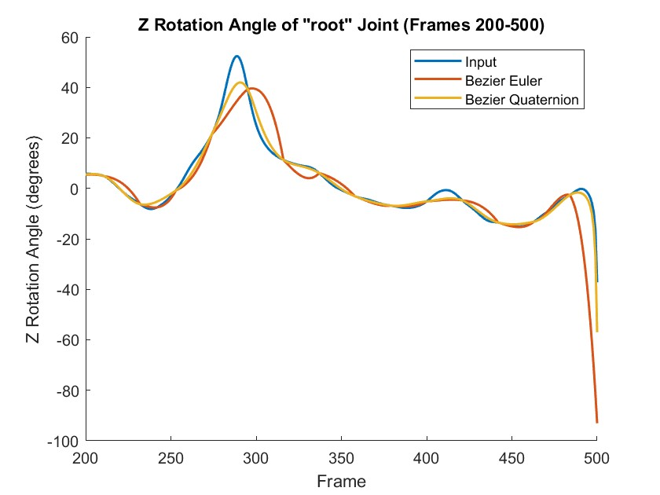

## **CSCI 520 Assignment 2: Motion Capture Interpolation**  
#### Isabella Rocha

### **Background**
This assignment was written on a Windows device using Visual Studio 2019. To change the command line input, the debugger under properties was used and then to run the Local Windows Debugger was used.

### **Basic Features**
* Able to convert from euler angles to quaternions and back
* Implemented SLERP to interpolate along the unit quaternion sphere
* Implemented all 3 interpolation methods: bezier euler, linear quaternion, and bezier quaternion
* Plotted four graphs comparing each interpolation method (Implemented with MATLAB under the graphs folder)

### **Report**

In this assignment, four interpolation schemes were used to interpolate human motion data obtained from an optical mocap system. The four methods used were linear euler interpolation, bezier euler interpolation, linear quaternion interpolation, and bezier quaternion interpolation.

The use of euler angles for each joint is the simplest to understand, as it has 3 variables for 3 axis in a 3D world; degrees around the x axis, then the y axis, and then the z axis. The first graph compares linear interpolation using euler angles and then bezier interpolation also using euler angles.

As can be seen, both provide movement pretty similar to the input. Fluctuation between keyframes is lost, however, this would be the case for any interpolation method as you are only looking at the data at specific keyframes and then predicting what occurs in between. Linear interpolation provides sharp pivots when it meets the input data at each keyframe, whereas bezier provides a smooth curve as intended, also intersecting the input data at each keyframe.

The next graph is very similar as it compares a linear interpolation method with a bezier one, however, this time both interpolation methods use quaternions. Quaternions are similar to complex numbers, however, have 4 terms instead of 2. Unit quaternions are used to represent rotations.

As we can see this (predictably) reflects the same properties as linear euler and bezier euler did, with linear interpolation providing straight lines and sharp changes in rotation and bezier smoothing this motion out into a curve.

The next graph compares both forms of linear interpolation.

While the plotted data between the two methods have similarities due to both being implemented linearly (making for straight lines and sharp angles), we can see just how much closer the quaternion interpolation hugs the input data, especially between around frames 250 to 275 and 290 to 310. Quaternions produce better results than euler angles due to the ease in which you can interpolate between them. Unit quaternions can be mapped onto the unit quaternion sphere. To find a smooth interpolation between two rotations, all you have to do is pick the shortest path along the surface of the sphere between the two corresponding quaternions. This leads to smoother transitions than euler angles, as is reflected in the above graph.

Finally, the last graph compares both forms of bezier interpolation.

While due to using the bezier function both methods provide smoother transitions, bezier euler still has visibly harsher and more erratic changes in roation than bezier quaternion, especially around frames 310 and 340. The bezier quaternion interpolation is much closer to the input.

Overall, linear interpolation has the advantages of being much simpler to compute and implement, however, bezier interpolation provides for a more visually appealing result due to the smooth transition between rotations rather than sharp, jerkier motions. Similarly, euler angles also provide for easier computations, however, can result in unexpected rotations and jerkier movements over quaternions. Quaternions also help avoid common pitfalls of euler angles, such as gimbal lock, which occurs when 3 gimbals are lines up in the same plane causing the system to only be able to move in 2 dimensions.

Another minute observation made during the assignment that helped to get more accurate results was implementing the idea that q = -q for rotations represented by quaternions. If the dot product between q1 and q2 was negative, it makes sense to negate one of them during SLERP to reverse the direction of interpolation, as this meant that the shortest path along the unit quaternion sphere is in the other direction. We are allowed to do this because q = -q, meaning both would be on the exact same spot on the unit quaternion sphere and thus represent the same rotation.
